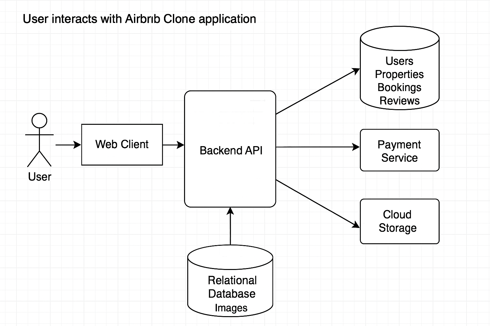

# Data Flow Diagram (DFD) - Airbnb Clone Backend

This directory contains the Data Flow Diagram (DFD) for the Airbnb Clone backend system. The DFD illustrates how data moves through the system's core processes, external entities, and data stores.

## Diagram:

*(Once you create your `data-flow.png` using Draw.io and save it in this directory, it will appear here.)*

