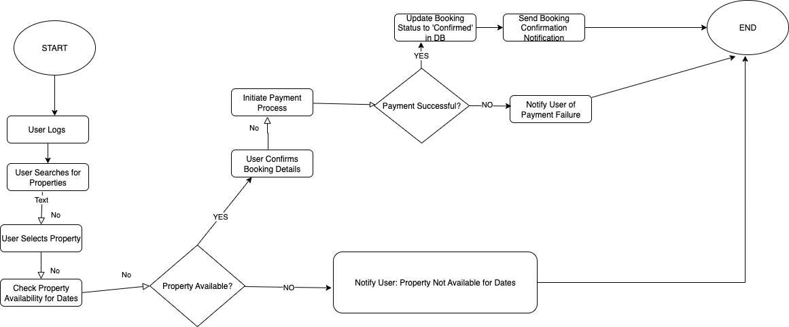

# Flowchart for System Process - Property Booking

This directory contains a flowchart visualizing a key backend system process. This specific diagram illustrates the workflow for the "Property Booking" process, detailing the steps and decision points involved from the user initiating a booking to its confirmation or failure.

## Flowchart:

*(Once you create your `data-flow-diagram.png` (the flowchart) using Draw.io and save it in this directory, it will appear here.)*

