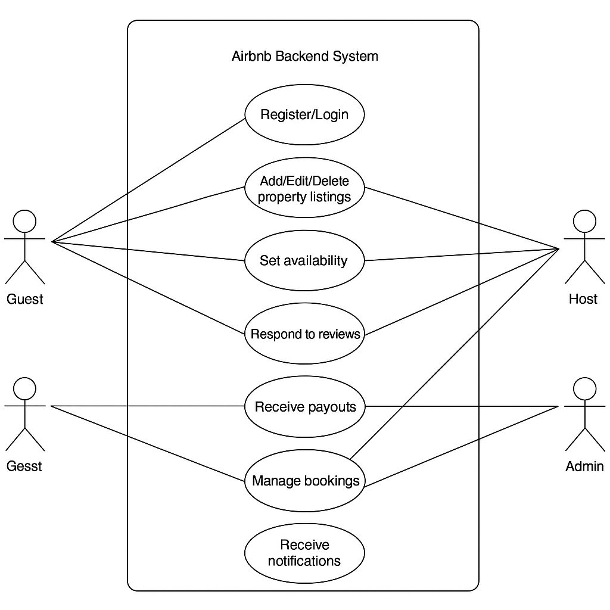

# Use Case Diagram - Airbnb Clone Backend

This document presents the Use Case Diagram for the Airbnb Clone backend system. This diagram visually represents the interactions between different types of users (actors) and the core functionalities (use cases) that the backend system provides. It helps to understand the system's high-level functionality from a user's perspective.

## Actors:

* **Guest:** A user who searches for, views, and books properties. They can also make payments and leave reviews.
* **Host:** A user who lists properties, manages their listings, and views bookings. They can also respond to reviews.
* **Admin:** A superuser who has oversight and management capabilities over users, properties, and bookings within the system.

## Key Use Cases:

The diagram below illustrates the following key interactions:

* **User Authentication & Profile Management:**
    * Register Account
    * Log In
    * Manage Profile
    * Log Out
* **Property Management:**
    * Add Property Listing
    * Edit Property Listing
    * Delete Property Listing
    * Search Properties
    * View Property Details
* **Booking Management:**
    * Book Property
    * Cancel Booking
    * View Bookings
* **Payment Integration:**
    * Make Payment
    * View Payment History
* **Reviews and Ratings:**
    * Leave Review
    * Respond to Review
* **Notifications:**
    * Receive Notifications
* **Administrative Functions:**
    * Manage Users
    * Manage Listings
    * Manage Bookings
    * Manage Payments

---

**Use Case Diagram:**

